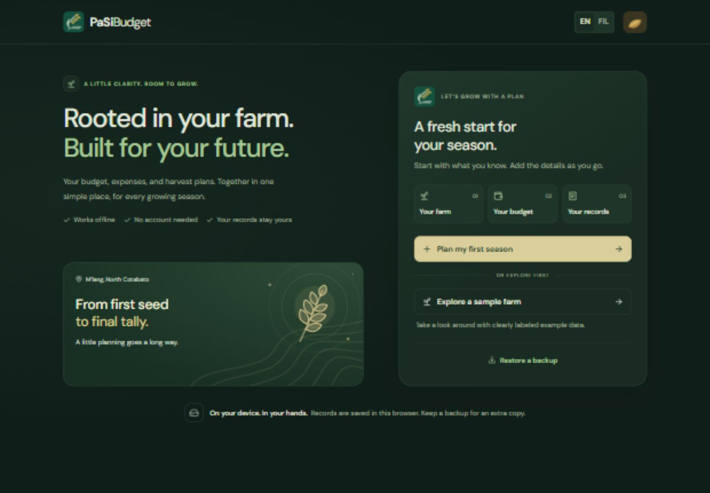
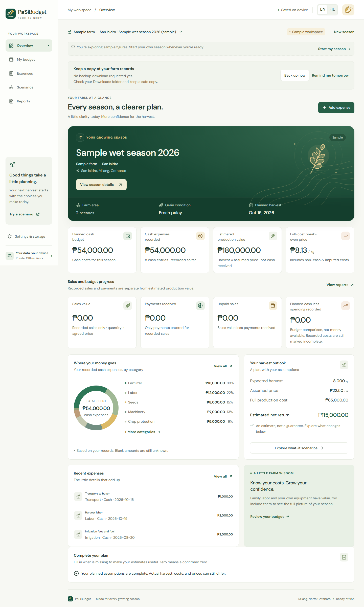
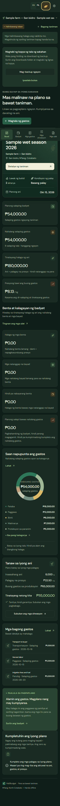

# PaSiBudget

A bilingual, offline rice-farm budget planner for M’lang, North Cotabato. Built with React, TypeScript, Vite, Dexie/IndexedDB, decimal.js, and a precaching service worker.

## Run locally

Install Node.js 22.12+ (or 20.19+) and double-click **Open_PaSiBudget.cmd**. It installs dependencies if needed, builds the app, and opens the production preview at **http://127.0.0.1:4173**. Keep the terminal running while using the local preview.

Or use these commands in this directory:

```powershell
npm.cmd ci
npm.cmd run build
npm.cmd run preview
```

For development: `npm.cmd run dev` serves http://127.0.0.1:5173.

**Use the same URL and browser for your records.** The development and production ports are separate storage locations, as are localhost and 127.0.0.1. Use backup/restore to transfer records. Offline mode requires one successful online load and service-worker installation on the production preview. A remote deployment would require HTTPS for offline installation.

## What you can do

- Start real farms and seasons or explore a clearly labeled, separate sample farm.
- Plan fixed and per-kilogram costs; classify each as cash, non-cash, or imputed.
- Open expense entry directly from Overview. Search expense names and notes, combine category and inclusive date filters, and reset them together.
- Record expenses, estimates, notes and confirmed zero amounts; compare complete category totals with the plan. Phone screens show labeled record cards.
- Enter harvest in kg or sacks using your own sack-weight conversion.
- Compare higher costs, lower harvests and lower prices. Saved scenarios preserve a copy of their original budget assumptions.
- Record sales and actual cash receipts, including partial payments, separately from the value of all harvested rice. Overview shows sales value, payments received and unpaid sales separately.
- Follow the completeness checklist to the missing harvest, price, costs or grain-condition settings. Planned cash less recorded spending is a budget comparison, not a bank balance or money available.
- Export a season CSV or print/save as PDF with farm and season identity, grain conditions, planned costs, expenses, sales, receipts, evidence labels and notes.
- Download a complete JSON backup and preview a restore before adding copies without overwriting existing records.
- Copy a previous real season’s planned costs, archive/unarchive seasons, and switch between English and Filipino.
- Switch themes with a ridged, angled rice grain: the husk opens for light mode and closes for dark mode. Keyboard and reduced-motion preferences are supported.
- Keep unsaved form and scenario edits protected by an in-app discard dialog. Save failures retain inputs; application updates wait until work is saved or discarded.







## How calculations work

For harvest `Q` kg and matching price `P` per kg, fixed cost `F` and variable cost `v` per kg:

```
C(Q) = F + vQ
Production value = QP
Estimated return = QP − C(Q)
Break-even price = F/Q + v
Break-even quantity = F/(P − v)
```

Break-even targets round upward to two decimals. If `P <= v` with positive fixed cost, there is no finite break-even quantity. Zero-harvest break-even price is unavailable. Planned and recorded costs are never added together. Cash and full production costs are displayed separately; each entry belongs to one cost kind.

Missing values remain unknown. Cost completeness must be explicitly confirmed, and an unknown cost still prevents complete results. Quantity and price must match in grain condition. Actual harvest and actual price have their own condition selectors, independent of planned assumptions. Production value is not cash received, and estimated returns are not guaranteed profit. Output-dependent fees use a fixed plus per-kg model; other fee arrangements must be entered as explicit scenario totals.

## Storage and privacy

There are no accounts, cloud sync, telemetry or financial-data services. Records stay in IndexedDB in the current browser on the current device. The UI explains persistent-storage availability and reminds users to request a backup before their first backup and after seven days; reminders can be dismissed for one day. The recorded time means a backup download was requested, not that the browser confirmed a safely stored file. Check your downloads and keep a copy somewhere safe.

Clearing browser storage, changing browsers, or losing a device can lose records without a backup. JSON backups contain farm financial records and are not encrypted. Database version 2 preserves existing amounts and asks users to confirm previously unknown actual grain conditions. Version 1 backups are accepted through validation and migration; new backups use version 2. See [migration and restore notes](docs/MIGRATION.md).

Fonts, artwork, icons and application assets are bundled for offline use. The sample values are invented solely for demonstrations; they are not verified farm costs, prices, or local market quotes.

## Verify

```powershell
npm.cmd run typecheck
npm.cmd test
npm.cmd run build
npx.cmd playwright install chromium
npm.cmd run test:e2e
npm.cmd audit
git diff --check
```

`npm.cmd run verify` combines type checking, unit tests and the production build. GitHub Actions repeats these checks and Chromium browser tests on pushes to `main` and pull requests. See [verification notes](docs/VERIFICATION.md) for executed checks and their limitations.

## Research boundaries

This prototype follows the supplied *Scenario-Based Decision-Support Framework for Rice Farm Budget Planning and Break-Even Analysis in M’lang, North Cotabato*. It does not predict yields or prices, recommend crops, approve loans, or claim income improvements. Formal farmer usability and comprehension studies have not been carried out by these software tests. Tiered fees, automated moisture conversion, receipt image extraction, multi-user access and cloud synchronization are outside this release.

Repository: [Gabbu69/PaSiBudget](https://github.com/Gabbu69/PaSiBudget). Source publication and local preview are separate from website deployment; no hosted website is included in this delivery.
